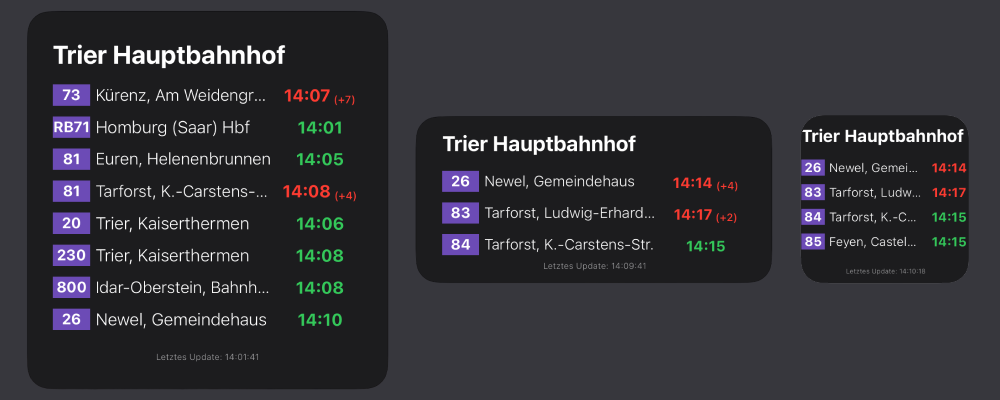

# vrn-scriptable-widget

A real-time public transport widget for the Verkehrsverbund Rhein-Neckar (VRN), designed for iOS using [Scriptable](https://scriptable.app/).  
Displays the next departures for any VRN stop directly on your home screen.

---

## ✨ Features

- Real-time departure information via VRN TRIAS interface
- Fully supports **small**, **medium**, and **large** widget sizes
- Clean UI: colored line tags, destination text, time, delay indicator
- Auto-updates via ScriptDude

---

## 📲 Quick Install via ScriptDude

### Installation Instructions

1. Install [ScriptDude](https://scriptdu.de) on your iPhone or iPad.
2. Click the button above.
3. On the ScriptDude page, tap the blue **Install** button.
4. Scriptable will open and ask to add the widget script.
5. Now add a Scriptable widget to your Home Screen:
   - Tap and hold → Add Widget → Scriptable
   - Choose any size (small, medium, large)
   - Tap and hold the widget → Edit Widget
   - Select `vrn-scriptable-widget` as script
   - Enter a stop name (e.g. `Kürenz Bonifatiusstraße`) as parameter

---

## ⚠️ Notes

- This project is unofficial and not affiliated with VRN or any regional transport agency.
- The script uses a personal TRIAS proxy based on the [VDV 431-2 standard](https://www.vdv.de/vdv-schriften.aspx).

---

## 📄 License

MIT License
